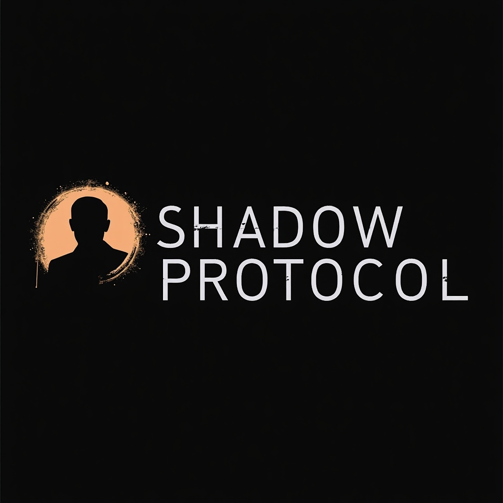

## Prompt : 

**Je veux que ca se passe dans une époque moderne donc enlève tout ce qu'il y a de futuristique**

## Réponse du prompt :

### **Nom du jeu : "Shadow Protocol"**  
 
Un **jeu d'action-aventure solo en monde ouvert** qui mélange l'intensité des jeux GTA et Uncharted, avec un ton sérieux mais ponctué d’un humour subtil. L’histoire prend place **dans notre époque moderne**, avec une intrigue digne des meilleurs films d’espionnage et de thrillers policiers.
 
---
 
## **Concept Général**  
Vous incarnez **Ethan Hayes**, un ancien agent d’élite des forces spéciales, accusé à tort d’un crime qu’il n’a pas commis. Traqué par ses anciens alliés et des factions criminelles, il se retrouve pris dans une **conspiration impliquant des gouvernements corrompus, des mercenaires et une organisation secrète** cherchant à manipuler les conflits internationaux pour leur profit.  
 
Votre objectif : **prouver votre innocence, révéler la vérité et survivre dans un monde où tout le monde semble vouloir votre peau**.  
 
L’action se déroule dans **une grande ville inspirée de New York ou Londres**, avec la possibilité de voyager vers d’autres lieux (cités portuaires, îles isolées, montagnes reculées, etc.).  
 
---
 
## **Gameplay**  
 
### **Exploration et Monde Ouvert**  
- **Ville dynamique et réactive** : Des quartiers riches, des banlieues, des bidonvilles, des zones industrielles et même des bases cachées.  
- **Interactions réalistes** : Corrompre des flics, infiltrer des bureaux sous une fausse identité, utiliser des caméras de surveillance pour espionner des cibles.  
- **Système de dissimulation et déguisements** : Pour infiltrer des endroits sécurisés sans déclencher d’alerte.  
 
### **Action et Combat**  
- **Gunfights réalistes et nerveux**, avec un système de couverture inspiré d’Uncharted et The Last of Us.  
- **Corps-à-corps brutal et cinématographique**, à la Jason Bourne ou John Wick.  
- **Des courses-poursuites en voiture ou à moto**, avec des séquences spectaculaires et interactives (se cacher dans la foule, utiliser des raccourcis).  
 
### **Missions et Enquête**  
- **Infiltrations et espionnage** : Se faufiler dans des bases, écouter des conversations, voler des documents sensibles.  
- **Missions à choix multiples** : Éliminer une cible ou la faire parler, collaborer avec un journaliste ou le trahir pour protéger son identité.  
- **Conduite et traque** : Poursuivre un criminel en voiture, interroger des informateurs, tendre des embuscades.  
 
### **Ton et Ambiance**  
- **Sérieux, mais avec un humour subtil** : Le protagoniste est cynique et badass, avec des punchlines à la James Bond ou Nathan Drake.  
- **Histoire immersive inspirée des thrillers d’espionnage**, entre Jason Bourne, Mission Impossible et Sicario.  
 
---
 
## **Résumé**  
**"Shadow Protocol"** vous plonge dans un **jeu d’action-aventure à monde ouvert**, où infiltration, courses-poursuites et fusillades s’enchaînent dans une **histoire captivante et immersive**. Entre conspirations, espionnage et survie, chaque choix aura un impact sur votre destin.  
 
🔥 **Préparez-vous à fuir, combattre et découvrir la vérité… avant qu’ils ne vous trouvent.**

## Prompt de génération de l'image : 

Fait moi un beau prompt pour une ia de generation d'image pour un logo qui représente bien la DA du jeu

**Prompt pour génération d'image (logo du jeu "Shadow Protocol")**  
 
*"Un logo stylisé et percutant pour un jeu d'action-aventure moderne. Le design doit refléter l'univers du jeu : un thriller d’espionnage intense avec une ambiance réaliste et immersive. Le logo doit inclure le titre **"Shadow Protocol"** dans une typographie élégante et moderne, inspirée des films d’espionnage et des jeux comme Uncharted ou Splinter Cell.  
 
L'esthétique doit être **sobre, classe et menaçante**, avec une palette de couleurs sombres (noir, gris acier, touches de rouge ou d'orange pour l'intensité). L'élément central pourrait représenter **un symbole de clandestinité et de danger**, comme une silhouette furtive, une cible d’opération secrète, ou un masque tactique.  
 
L'ambiance visuelle doit évoquer le **mystère, la tension et l'action**, avec un effet légèrement usé ou granuleux, rappelant les dossiers confidentiels et les missions gouvernementales top secrètes. Le fond peut être texturé, avec des éléments subtils comme des cartes géopolitiques floues, des lignes de code cryptées ou des empreintes digitales.**  
 
Ce logo doit être à la fois **moderne, professionnel et marquant**, idéal pour un blockbuster vidéoludique immersif et nerveux."*

