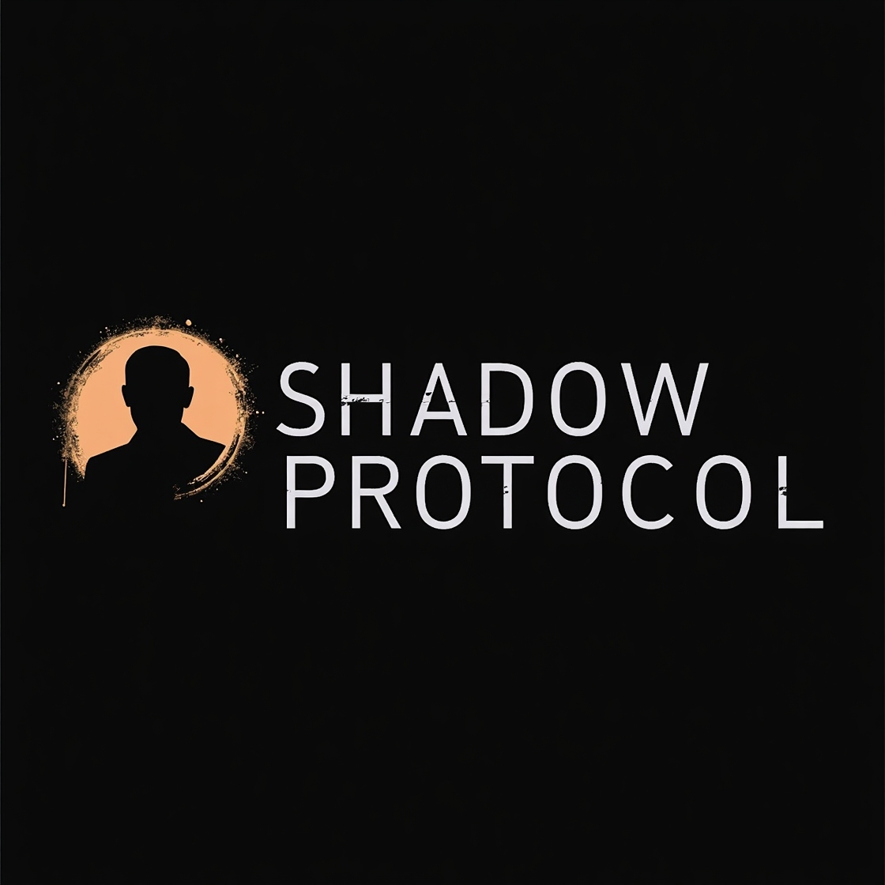
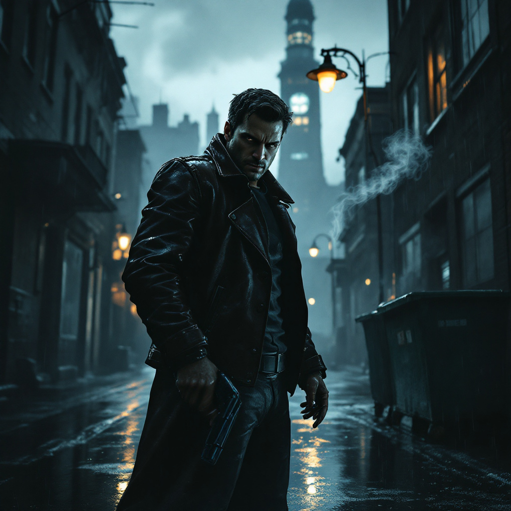
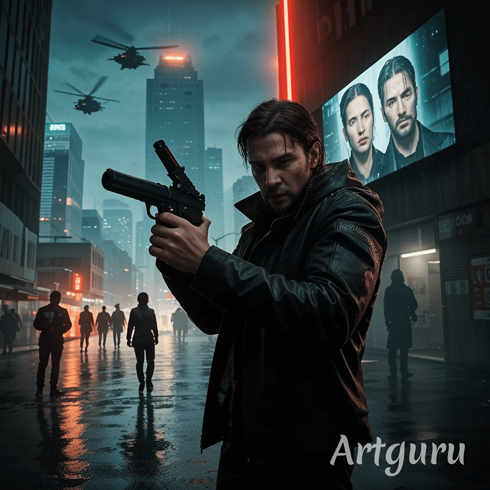
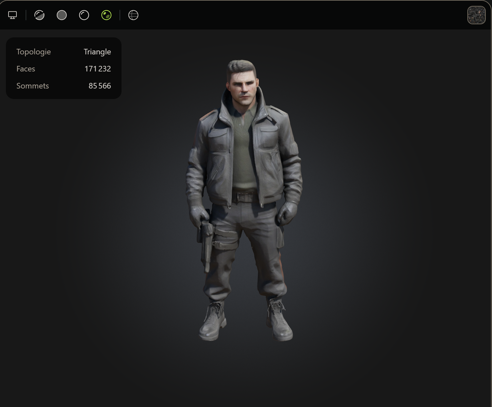

Groupe de Alan ROYER et Yassine THYFA FILALI

## Nom du jeu : Shadow Protocol

 
## Sujet
 
Créer un jeu vidéo à l'aide de l'IA. Le but est de selectionner les meilleurs prompts et réponses

On utilise ChatGPT et LeonardoIA 

## 1. Brainstorming 

On utilise ChatGPT 4o pour la génération du texte. Pour le brainstorming on commence avec le prompt suivant : 

Propose moi un jeu en 3d blockbuster épique moderne et avec un une pointe d'humour mais qui reste sérieux jeu solo style gameplay gta ou uncharted

**Idée principale**  
Imaginez un héros moderne, ancien agent d'élite, qui se retrouve mêlé à une conspiration mondiale mêlant mystères anciens et technologies futuristes. L'intrigue se déploie dans un univers riche où le passé et le présent s'entremêlent, forçant le joueur à naviguer entre énigmes historiques et combats intenses. Le tout, avec une touche d'humour subtile dans les dialogues et les situations, qui apporte légèreté et dynamisme tout en gardant un ton sérieux.

## 2. Identité

### **Nom du jeu : "Shadow Protocol"**  
 
Un **jeu d'action-aventure solo en monde ouvert** qui mélange l'intensité des jeux GTA et Uncharted, avec un ton sérieux mais ponctué d’un humour subtil. L’histoire prend place **dans notre époque moderne**, avec une intrigue digne des meilleurs films d’espionnage et de thrillers policiers.

Logo générer avec Leonardo IA 

## 3. Génie Artistique

### **Génie artistique du concept**  
 
#### **Personnages**  
Les personnages doivent être **réalistes et détaillés**, inspirés des films d’action et de thrillers modernes comme *John Wick, Mission Impossible, Sicario* ou *Jason Bourne*.  
 
- **Protagoniste (Ethan Hayes)** 
  
 
- **Antagonistes & PNJ** 

 
#### **Décors**  
Le monde du jeu doit être **gritty, réaliste et immersif**, capturant l’essence des grandes métropoles modernes et des zones isolées où l’action peut basculer à tout moment.  
 
- **Villes inspirées de New York, Londres ou Berlin**, avec des quartiers riches, des zones industrielles délabrées et des ruelles sombres.  
- **Bureaux gouvernementaux ultra-sécurisés**, aux couleurs froides et lumières artificielles, où les opérations secrètes se trament.  
- **Ruelles humides et bars clandestins**, où se déroulent les négociations entre espions et criminels.  
- **Missions d’infiltration sur des toits d’immeubles, docks abandonnés ou villas de millionnaires corrompus**, avec une architecture détaillée et des éclairages cinématographiques.  
 
#### **Éléments Clés pour les Illustrations de Concept**  
- **Tonalité sombre et réaliste**, avec des contrastes forts (jeux d’ombres et lumières style *neo-noir*).  
- **Effet de grain et textures rugueuses**, évoquant un monde dangereux et sans pitié.  
- **Détails technologiques modernes mais discrets** (caméras de surveillance, dossiers confidentiels, ordinateurs de contrôle).  
- **Mise en scène cinématographique**, avec des plans dynamiques et un éclairage dramatique.  
 

## 4. Scénario et narration 

#### **Histoire du jeu :**  
*Shadow Protocol* raconte l’histoire de **Ethan Hayes**, un ancien agent des forces spéciales, qui se retrouve accusé à tort d’un crime qu’il n’a pas commis. Après avoir été trahi par ceux qu’il considérait comme ses alliés, Ethan doit naviguer dans un monde complexe où la vérité est un luxe et la survie une priorité. Accusé d’une tentative d’assassinat contre un politicien de haut niveau, Ethan découvre rapidement qu’il est la cible d’une conspiration bien plus vaste qui implique des **organisations secrètes**, des **gouvernements corrompus** et des **groupes criminels internationaux**.
 
Le jeu explore la lutte d'Ethan pour **prouver son innocence** tout en révélant les sombres secrets derrière la manipulation des conflits mondiaux. Dans un jeu où les **alliances se brisent** et les **traîtrises se multiplient**, le protagoniste devra naviguer à travers un monde de plus en plus hostile, tout en recherchant des informations cruciales pour stopper la machination avant qu’il ne soit trop tard.
 
L’histoire se déroule dans une **grande ville moderne**, mais s’étend également à des lieux plus reculés et isolés, où Ethan devra faire face à des situations de plus en plus périlleuses.
 

## 5. Musique et bande son

### **Prompt pour IA de création musicale**  
 
Créer une bande-son immersive pour un jeu d’action-aventure et d’espionnage moderne, **Shadow Protocol**. La musique doit capturer une **tension cinématographique intense** avec des éléments de **thriller et d’infiltration**. 

#### **Genre de musique et effets sonores**  
La bande-son de *Shadow Protocol* doit capturer l’essence des thrillers d’espionnage modernes avec **une musique orchestrale sombre mêlée à des sons électroniques subtils et percussifs**.  
 
- **Thème principal** : Un morceau puissant et mémorable, mélangeant **cordes dramatiques, percussions profondes et basses électroniques**, évoquant tension et mystère. Inspiré de *Hans Zimmer* (Inception, Dark Knight), *Lorne Balfe* (Mission Impossible: Fallout), et *John Powell* (Jason Bourne).  
- **Musique d’exploration** : Ambiance sonore immersive, minimaliste et discrète, avec des nappes synthétiques, des basses vibrantes et des percussions feutrées, renforçant l’impression d’infiltration et de danger latent.  
- **Moments de tension** : Mélodies répétitives et oppressantes, avec des cordes saccadées et des pulsations électroniques, créant une montée progressive du stress.  
- **Séquences d’action et de poursuite** : Rythme effréné avec des percussions agressives, des cuivres intenses et des sonorités industrielles brutes, amplifiant l’adrénaline des combats et des courses-poursuites.  
- **Moments émotionnels** : Piano et cordes profondes pour illustrer les dilemmes moraux et les pertes du protagoniste.  

## 6. Modélisation 3D

## **Prompt IA – Création de personnages 3D**  
 
*"Créer un modèle 3D ultra-réaliste d’un agent d’élite moderne. Homme athlétique, visage expressif avec cicatrices discrètes. Vêtu d’une veste tactique sombre, gants en cuir, holster et oreillette high-tech. Texture peau réaliste, vêtements détaillés avec plis et usure naturelle. Éclairage cinématographique et posture prête à l’action, inspiré des films d’espionnage comme Mission Impossible et Jason Bourne."*

## Réponse du prompt :

### **Modélisation 3D**  
 
#### **Personnages et Objets**  
Les personnages doivent être **réalistes et détaillés**, avec des proportions anatomiques précises et des textures peaufinées (rides, cicatrices, plis des vêtements).  
 
- **Protagoniste (Ethan Hayes)** :  
  - Corps athlétique mais discret, adapté à l’infiltration.  
  - Visage expressif avec un regard intense, cicatrices subtiles et barbe légère.  
  - Vêtements tactiques modernes : veste en cuir sombre, gants discrets, holster sous l’aisselle, oreillette high-tech.  
  - Armes et gadgets détaillés : pistolet silencieux, couteau pliable, smartphone modifié.  
 
- **PNJ et ennemis** :  
  - Mercenaires avec équipements paramilitaires crédibles (gilets pare-balles, chargeurs, casques tactiques).  
  - Politiciens et criminels avec costumes raffinés mais menaçants.  
  - Détails réalistes : pores de peau, fibres textiles, usure des armures et armes.  
 
#### **Détails pour refléter le thème visuel**  
- **Textures ultra-réalistes** : matériaux détaillés (cuir usé, métal rayé, tissus froissés).  
- **Éclairage dynamique** : effets de lumière réalistes sur les visages et objets.  
- **Animations naturelles et fluides** : mouvements réalistes en infiltration et combat.  

